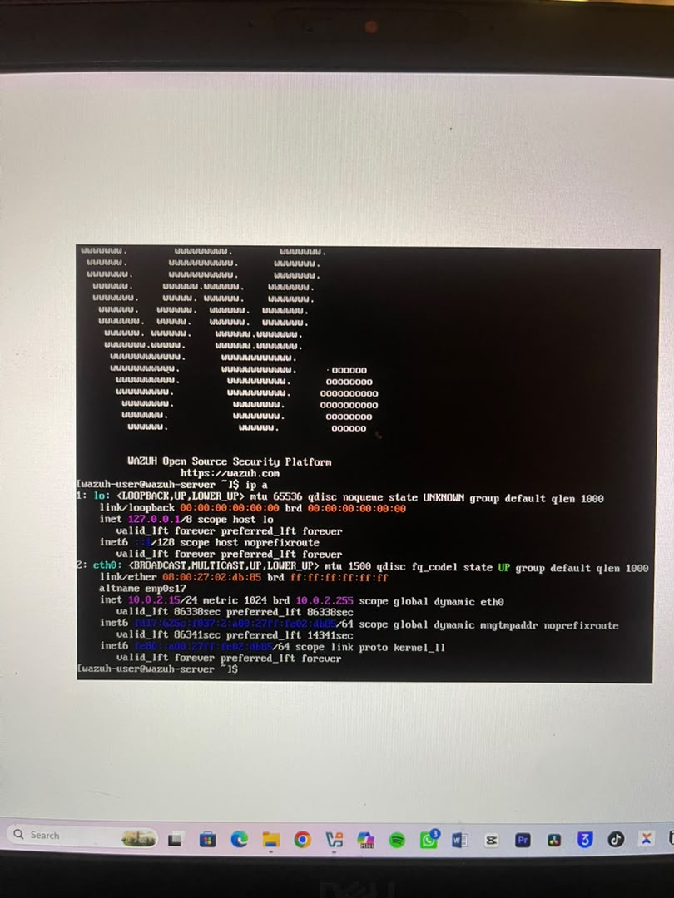
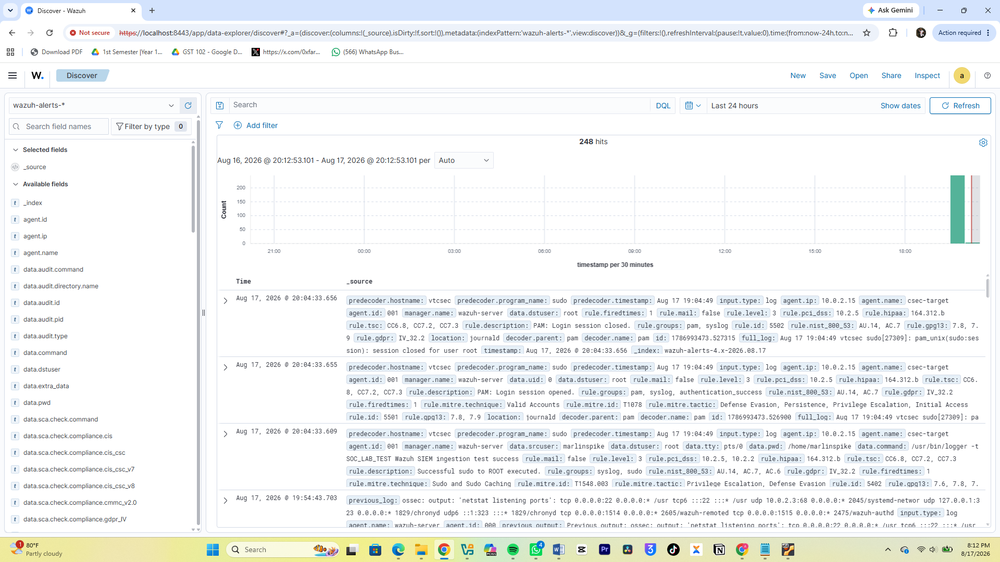

# SOC Analyst Portfolio

Welcome to my defensive security portfolio. Here, I will document my hands-on SOC lab writeups, SIEM detection rules, incident response reports, and threat analysis playbooks as I complete them.

## 🛠️ Tools & Technologies
* **SIEM:** Wazuh
* **Endpoint Telemetry:** Sysmon, Windows Event Logs
* **Analysis:** Wireshark, CyberChef, VirusTotal

## 📁 Projects
### 1. Wazuh SIEM & Windows Telemetry Home Lab (In Progress)
* **Goal:** Build a dedicated SOC lab to ingest, analyze, and detect endpoint threat activity using Wazuh SIEM.
* 
* **Completed:** 
  * Configured Oracle VirtualBox environment and successfully booted the Wazuh v4.14.7 OVA server. 
  * Solved hypervisor resource allocation limits and configured NAT port forwarding for dashboard access.
  * Initiated fresh target Windows VM installation.
 
#### Phase 1: Environment Setup & Infrastructure
* Configured Oracle VirtualBox NAT Network (`ShubbyCyber-SOC-Lab-Network`) on subnet `10.0.2.0/24`.
* Imported and deployed Wazuh v4.14.7 OVA server instance (`10.0.2.3`).
* Bypassed guest OS rendering constraints by establishing host-to-guest NAT port forwarding (`127.0.0.1:8443` -> `10.0.2.3:443`), enabling dashboard access via host browser.

#### Phase 2: Telemetry Verification & Log Ingestion
* Connected `csec-target` Ubuntu endpoint (`10.0.2.15`) running Wazuh Agent v4.9.0.
* Verified active connection and tested log ingestion pipeline by firing a custom test payload (`sudo logger -t SOC_LAB_TEST "Wazuh SIEM ingestion test success"`).
* Confirmed real-time log parsing in Wazuh **Discover**, matching Rule ID `5402` and mapping to MITRE ATT&CK Technique **T1548.003** (*Privilege Escalation*).

#### Current Status
* ⏳ Deploying Windows 10 target endpoint (`Win10-Target`) to configure Sysmon and Windows Event Log forwarding.
* My windows 10 has failed to install but I will continue to work with what I have.

* # SSH Brute-Force Simulation & SIEM Alert Escalation
## Project Overview
Simulated an SSH brute-force attack against an Ubuntu target (`csec-target`) to analyze authentication logging, Wazuh decoder behavior, and high-severity correlation escalation.

## Environment & Tools
* **Target Endpoint:** Ubuntu Linux (`csec-target`) running `wazuh-agent`
* **SIEM Manager:** Wazuh Server v4.x
* **Attack Tool:** Hydra
* **Telemetry Source:** `/var/log/auth.log`

## Execution Steps & Analysis

### 1. Attack Simulation
Generated failed SSH authentication attempts using Hydra against `127.0.0.1` with a custom wordlist.

### 2. Telemetry Capture & Low-Severity Detection
Individual failed authentication attempts triggered baseline syslog alerts:
* **Rule ID 5710:** `sshd: Attempt to login using a non-existent user`
* **Severity:** Level 5
* **MITRE ATT&CK Mapping:** T1110.001 (Password Guessing)

### 3. Correlation & Escalation
Executing sequential authentication attempts crossed the correlation threshold, triggering composite rules:
* **Rule ID 2502:** `syslog: User missed the password more than one time` (Severity Level 10)
* **Rule ID 5750:** `Maximum authentication attempts exceeded`
* **MITRE ATT&CK Mapping:** T1110 (Brute Force)

## Key Takeaways
* Individual login failures generate low-severity noise, but SIEM correlation rules escalate sequential patterns into actionable high-priority alerts.
* Telemetry correctly tags compliance mappings across NIST 800-53 (AU.14, AC.7) and PCI-DSS (10.2.4, 10.2.5).
